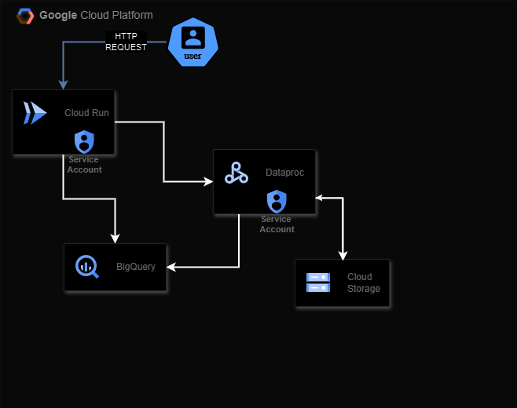

# Workloads-Api



Em um novo projeto na GCP com **billing ativado**, **utilizando o cloud shell**

**Autorizar a CLI gcloud**: https://cloud.google.com/sdk/docs/authorizing?hl=pt-br

**Necessario conta com privilegios**

  roles/owner or 
  roles/editor

### First step
**clonar o repo e definir o projeto**
#### Provisionar contas e permissões (Provisiona bucket,contas de serviço, libera APIs de serviços, concede permissões as contas de serviços)
```shell
python3 -m venv env 
source env/bin/activate
pip3 install ansible requests google-auth

export PROJECT_ID=$(gcloud config get-value project)
export REGION=us-central1
ansible-galaxy collection install google.cloud
ansible-playbook ./ansible/playbook.yaml
```
Em caso de erro no processo de liberar as APIs para o projeto ([*Setup google API`s*](https://github.com/vargacypher/gcp_workloads_api/blob/master/ansible/enable_apis.sh)), verificar possiveis serviços que podem não ter sido cobertas, habilitalos manualmente e rodar playbook novamente.


#### Buildar app
```shell
deactivate && rm -rf env
gcloud builds submit --config cloudbuild.yaml --substitutions _PROJECT_ID=$PROJECT_ID,_COMMIT_SHA=latest,_REGION=$REGION,_API_SA=api-sa@$PROJECT_ID.iam.gserviceaccount.com,_SPARK_SA=spark-sa@$PROJECT_ID.iam.gserviceaccount.com

gcloud compute networks subnets update default  --region=$REGION --enable-private-ip-google-access

```


#### Testes (Demo spark word-count)

## Endpoints:
- **/v1/healthcheck**- Checar status da API
- **/v1/workloads/batch-cluster/submit-demo**  - Submeter workload spark para contar palavras
- **/v1/workloads/batch-cluster/get-demo-status/{workload_id}** - Resgatar status do Dataproc job
- **/v1/workloads/batch-cluster/get-demo-result**  - Retorna 100 registros da tabela que armaneza a contagem final do job spark.

### Teste na API

```shell

#Exporta a URL do servico cloud run
export URL=$(gcloud run services describe workloads-api --format='value(status.url)')
#Seleciona a regiao
32 us-central1 OU SUA $REGIAO

export STS_TOKEN=$(gcloud auth print-identity-token)

curl $URL/healthcheck -H "Authorization: Bearer $STS_TOKEN"
```

#### Submetar workload para contar palavras em dataset no BQ

[spark_word_count.py](https://github.com/vargacypher/gcp_workloads_api/blob/master/ansible/spark_word_count.py)

```shell
curl -X 'POST' $URL/v1/workloads/batch-cluster/submit-demo?python_file_url=gs%3A%2F%2Ftest_spk%2Fspark_word_count.py -H "Authorization: Bearer $STS_TOKEN"
```

#### Verificar status do workload

```shell
#Utilizar o workload_id retornado no step anterior para resgatar o status
curl $URL/v1/workloads/batch-cluster/get-demo-status/${WORKLOAD_ID_RETORNADO_NO_CURL_ANTERIOR} -H "Authorization: Bearer $STS_TOKEN"  
```

#### Verificar 100 primeiros registros da tarefa de contar palavaras

- Resultado completo disponivel no BQ $PROJECT_ID:wordcount_dataset.wordcount_output

```shell
curl $URL/v1/workloads/batch-cluster/get-demo-result -H "Authorization: Bearer $STS_TOKEN"
```

